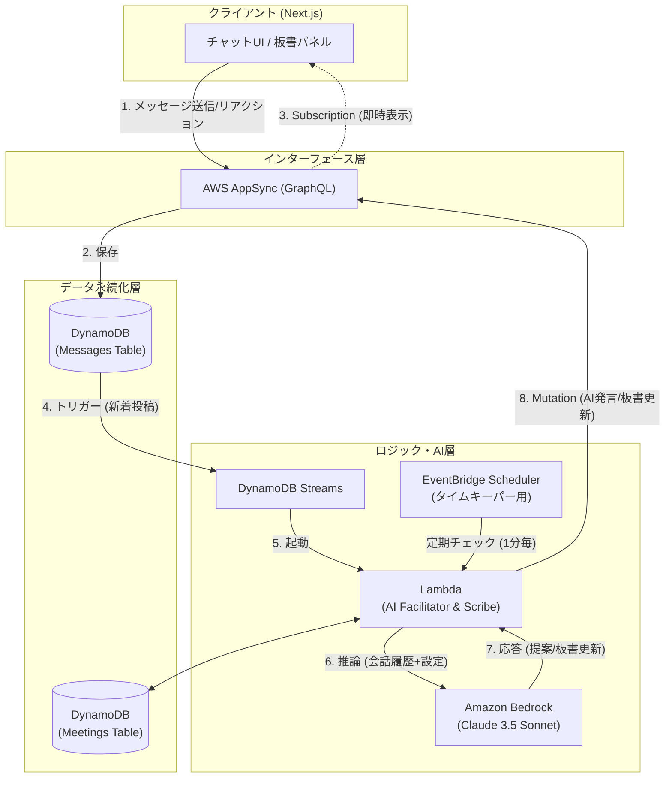

# TALKNAVI アーキテクチャ設計書

## 1. システム構成図 (AWS Serverless)

リアルタイム性と AI の非同期処理を両立させるため、AppSync と DynamoDB Streams を活用する。

## 2. 技術スタック選定理由

| コンポーネント | 選定技術                           | 理由                                                                         |
| :------------- | :--------------------------------- | :--------------------------------------------------------------------------- |
| **Frontend**   | Next.js (React)                    | モダンな UI 構築、Vercel/Amplify 等へのデプロイ容易性。                      |
| **API**        | AWS AppSync                        | リアルタイム通信(Subscription)の実装コスト低減。サーバーレスでスケーラブル。 |
| **Database**   | Amazon DynamoDB                    | 高速な R/W、Streams によるイベント駆動アーキテクチャとの親和性。             |
| **AI Model**   | Amazon Bedrock (Claude 3.5 Sonnet) | 日本語性能、指示追従性、コストパフォーマンスのバランスが最適。               |
| **Compute**    | AWS Lambda                         | サーバー管理不要、イベント駆動での実行。                                     |

## 3. データモデル設計 (DynamoDB)

### 3.1 Meetings Table (会議管理)

会議の設定と現在の状態（板書含む）を管理する。

| Attribute          | Type        | Description                                            |
| :----------------- | :---------- | :----------------------------------------------------- |
| `MeetingID`        | String (PK) | 会議の一意な ID (UUID)                                 |
| `Title`            | String      | 会議名                                                 |
| `Goal`             | String      | 会議のゴール                                           |
| `Rules`            | List        | 禁足事項リスト                                         |
| `StartTime`        | String      | 開始予定時刻 (ISO8601)                                 |
| `Duration`         | Number      | 予定所要時間 (分)                                      |
| `Status`           | String      | `SCHEDULED`, `IN_PROGRESS`, `COMPLETED`                |
| `BoardContent`     | Map/JSON    | 現在の板書データ（構造化された議論の内容）             |
| `PendingQuestions` | List        | 未解決の「？」リアクションがついたメッセージ ID リスト |

### 3.2 Messages Table (メッセージログ)

チャットの全履歴を保存する。

| Attribute    | Type        | Description                                         |
| :----------- | :---------- | :-------------------------------------------------- |
| `MeetingID`  | String (PK) | 会議 ID                                             |
| `Timestamp`  | String (SK) | 送信日時 (ISO8601)                                  |
| `MessageID`  | String      | メッセージの一意な ID                               |
| `SenderID`   | String      | 送信者 ID (または "AI")                             |
| `SenderName` | String      | 送信者表示名                                        |
| `Content`    | String      | メッセージ本文                                      |
| `Type`       | String      | `TEXT`, `SYSTEM`, `FACILITATOR_PROPOSAL`            |
| `Reactions`  | Map         | リアクション集計 (例: `{"like": 3, "question": 1}`) |

## 4. 処理フロー詳細

### 4.1 メッセージ送信時

1.  ユーザーが AppSync 経由でメッセージ送信。
2.  DynamoDB `Messages Table` に保存。
3.  AppSync Subscription により、全参加者の画面に即時反映。

### 4.2 AI 思考プロセス (DynamoDB Streams)

1.  `Messages Table` への書き込みをトリガーに Lambda が起動。
2.  Lambda は `Meetings Table` から会議設定と現在の板書を取得。
3.  直近の会話履歴と共に Bedrock へプロンプト送信。
4.  Bedrock が以下を判断・生成：
    - 板書の更新が必要か？ → 必要なら `Meetings Table` の `BoardContent` を更新。
    - 介入が必要か？（提案、質問確認など） → 必要なら `Messages Table` に `FACILITATOR_PROPOSAL` タイプのメッセージを追加（または専用の通知 Mutation を実行）。
5.  更新結果は AppSync 経由でクライアントにプッシュされる。
